# Shadow Edge Selective Ray Tracing

## Overview

**Shadow Edge Selective Ray Tracing** is a Vulkan-based rendering project that improves shadow quality by applying ray tracing selectively to the edge regions of shadows generated from shadow maps.

Instead of performing full-screen ray-traced shadow evaluation, this project focuses ray tracing only on shadow boundary areas where artifacts and aliasing are most noticeable. This approach aims to achieve a better balance between visual quality and rendering performance.

The current implementation supports a single light source.

This project is based on [Sascha Willems' Vulkan repository](https://github.com/SaschaWillems/Vulkan).

---

## Motivation

Traditional shadow mapping is efficient, but it often suffers from visual artifacts such as jagged shadow edges, aliasing, and limited precision near shadow boundaries.

Ray tracing can produce more accurate and visually pleasing shadows, but applying it to the entire scene can be expensive. This project explores a hybrid approach inspired by selective ray-traced shadow techniques, where ray tracing is applied only to regions that benefit the most from it: the edges of shadows.

---

## Vulkan-CUDA Interoperability

This project uses Vulkan-CUDA interoperability to combine Vulkan-based rendering with CUDA-based parallel computation.

Vulkan is responsible for graphics rendering tasks such as shadow map generation, geometry pass rendering, selective ray tracing, and final image composition. CUDA is used for parallel image processing and coordinate transformation operations required during the selective ray tracing pipeline.

To enable efficient GPU-side data sharing and synchronization between Vulkan and CUDA, this project utilizes CUDA external resource interoperability features, including:

| CUDA Type | Purpose |
|---|---|
| `cudaExternalSemaphore_t` | Synchronizes shared GPU resources between Vulkan and CUDA. |
| `cudaExternalMemory_t` | Imports Vulkan-allocated memory into CUDA for direct GPU-side access. |
| `cudaMipmappedArray_t` | Represents imported image resources in CUDA as mipmapped arrays. |
| `cudaTextureObject_t` | Provides texture-based access to imported image data during CUDA processing. |

By sharing GPU resources directly between Vulkan and CUDA, the project avoids unnecessary CPU-GPU readback and upload operations. This allows intermediate rendering results, such as shadow maps and geometry pass outputs, to be processed by CUDA more efficiently.

The current implementation uses CUDA for the following parallel computation tasks:

- Transforming shadow map coordinates into screen space using matrix multiplication
- Generating the shadow image
- Applying Sobel filtering to detect shadow edge regions
- Preparing the edge mask used for selective ray tracing

---

## Algorithm

The rendering pipeline is performed in the following order.

| Step | Stage | Description |
|---|---|---|
| 1 | Build Shadow Map | A shadow map is generated from the light's point of view. |
| 2 | Geometry Pass | Scene geometry information is rendered from the camera's point of view. |
| 3 | CUDA Update | CUDA is used to process shadow-related data in parallel. This includes coordinate transformation, shadow image generation, and edge detection. |
| 4 | Selective Ray Tracing | Ray tracing is applied only to the detected shadow edge regions. |
| 5 | Final Composition | The ray-traced edge result is combined with the shadow map result to produce the final image. |

### CUDA Update

During the CUDA update stage, the following operations are performed:

1. Coordinates from the shadow map are transformed into screen space using matrix multiplication.
2. A shadow image is generated based on the transformed shadow map information.
3. Sobel filtering is applied to the generated shadow image.
4. An edge image is created from the Sobel filtering result.
5. The edge image is used as a mask for selective ray tracing.

### Shared Memory Usage

CUDA shared memory is used to improve the performance of image-based parallel computation.

The following image illustrates how shared memory is used during CUDA processing:

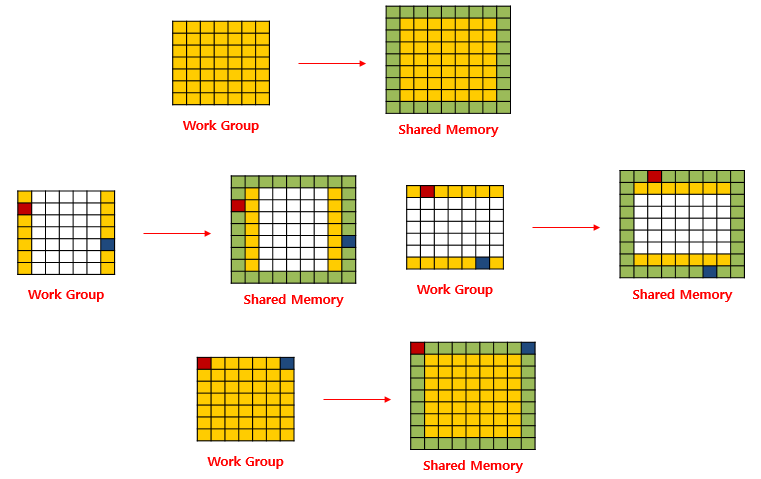

---

## Assets

This project uses custom glTF assets prepared for research purposes.

The asset directory should follow a structure similar to the one used in [Sascha Willems' Vulkan Assets repository](https://github.com/SaschaWillems/Vulkan-Assets/tree/a27c0e584434d59b7c7a714e9180eefca6f0ec4b).

Expected asset directory structure:

```text
assets
├── models
├── textures
├── Roboto-Medium.ttf
└── Roboto-Medium-license.txt
```

## Camera Interface

### Keyboard Controls

| Input | Action |
|---|---|
| `W` | Move forward |
| `S` | Move backward |
| `A` | Move left |
| `D` | Move right |
| `E` | Move up |
| `Q` | Move down |
| `R` | Reset to the original camera position and rotation |

### Mouse Controls

| Input | Action |
|---|---|
| Left mouse button | Rotate camera using pitch and yaw |
| Right mouse button | Roll camera |
| Middle mouse button | Move camera along the X and Y axes |
| Mouse wheel | Move camera forward or backward |

### Arrow Key Controls

| Input | Action |
|---|---|
| `→` | Increase yaw |
| `←` | Decrease yaw |
| `↓` | Decrease pitch |
| `↑` | Increase pitch |

### Camera Speed Controls

| Input | Target | Action |
|---|---|---|
| `-` | Keyboard movement speed: `W`, `A`, `S`, `D`, `E`, `Q` | Decrease speed |
| `+` | Keyboard movement speed: `W`, `A`, `S`, `D`, `E`, `Q` | Increase speed |
| `{` | Mouse control speed: left, middle, and right mouse buttons | Decrease speed |
| `}` | Mouse control speed: left, middle, and right mouse buttons | Increase speed |

---

## Results

### Without Shadow

| Conrnell Box |
|---|
| 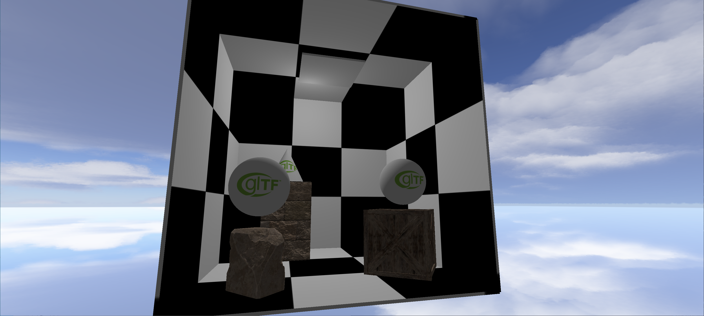 |

| Sponza |
|---|
| 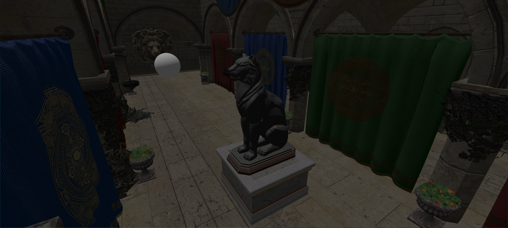 |

| Bistro Exterior |
|---|
| 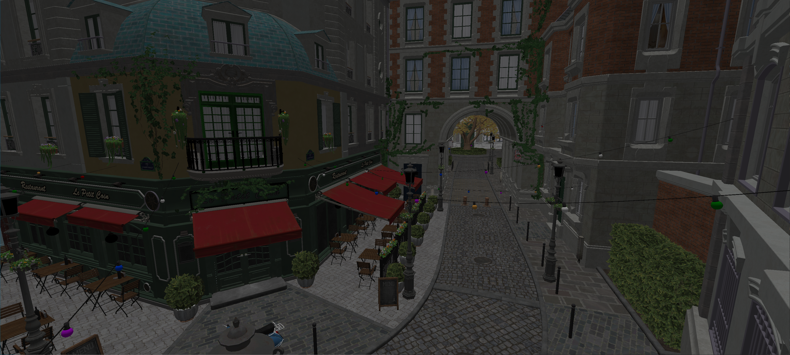 |

### Position Texture

| Conrnell Box |
|---|
| 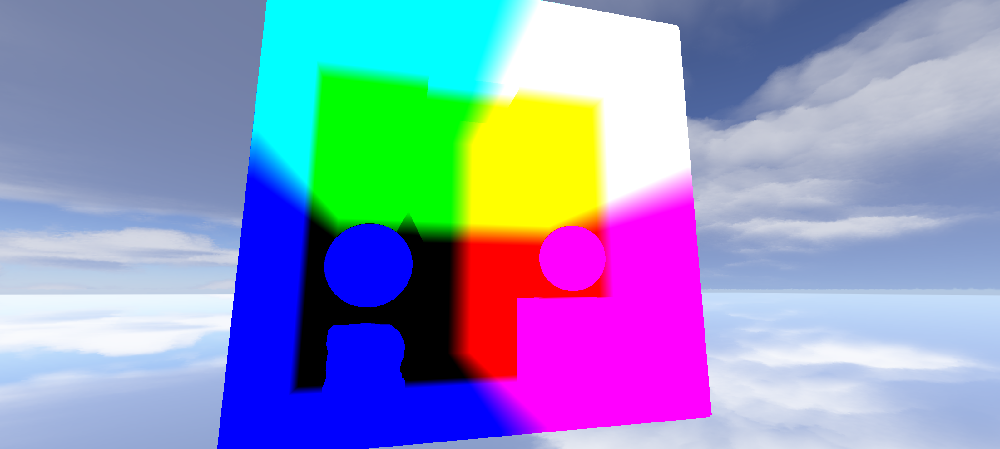 |

| Sponza |
|---|
| 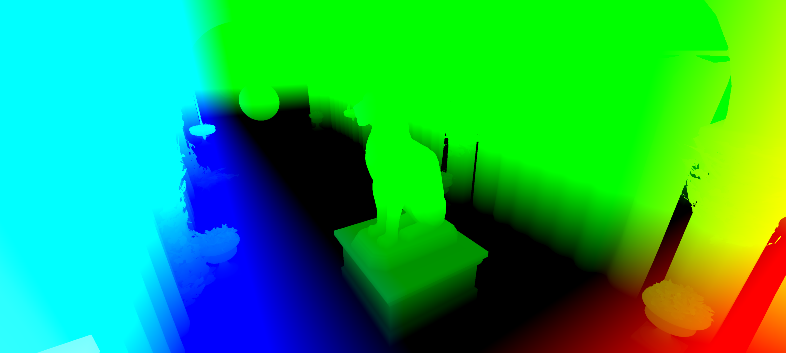 |

| Bistro Exterior |
|---|
| 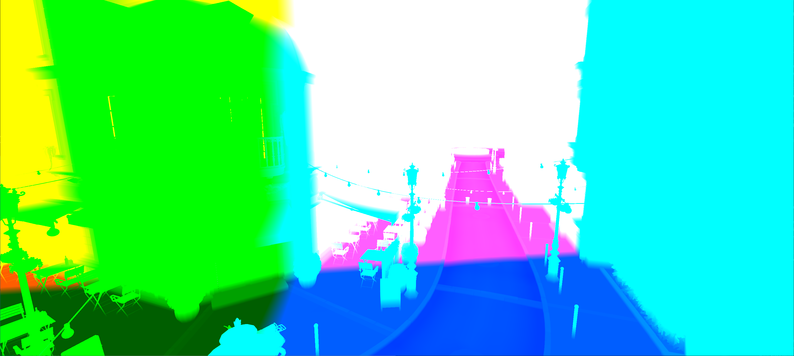 |

### Shadow Texture

| Shadow Box |
|---|
| 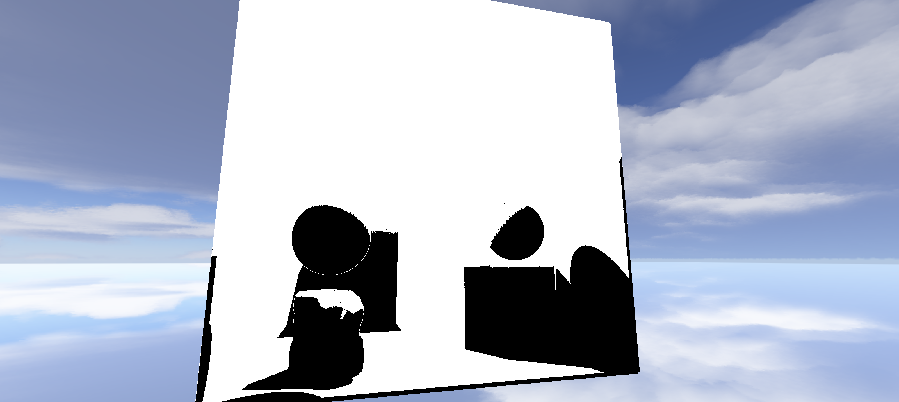 |

| Sponza |
|---|
| 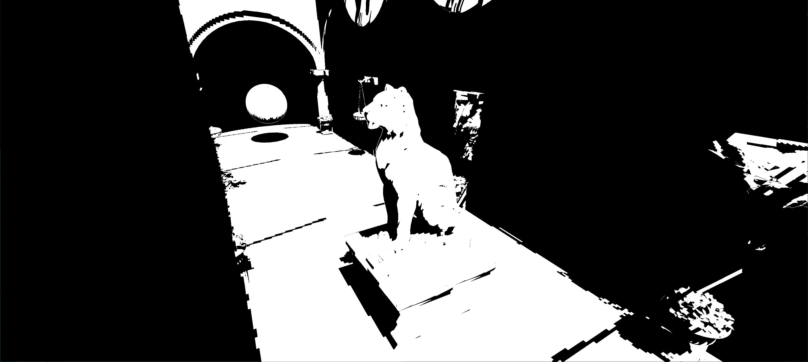 |

| Bistro Exterior |
|---|
| 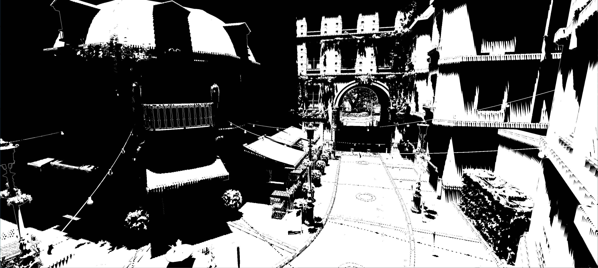 |

### Shadow Edge Texture

| Shadow Box |
|---|
| 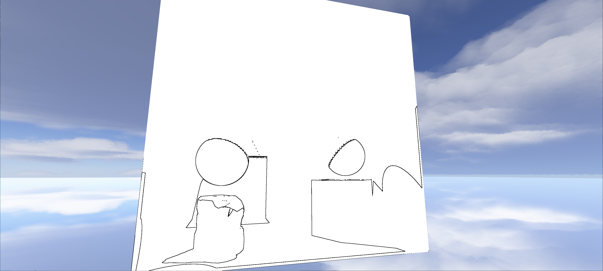 |

| Sponza |
|---|
| 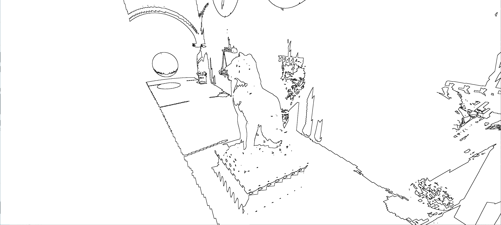 |

| Bistro Exterior |
|---|
| 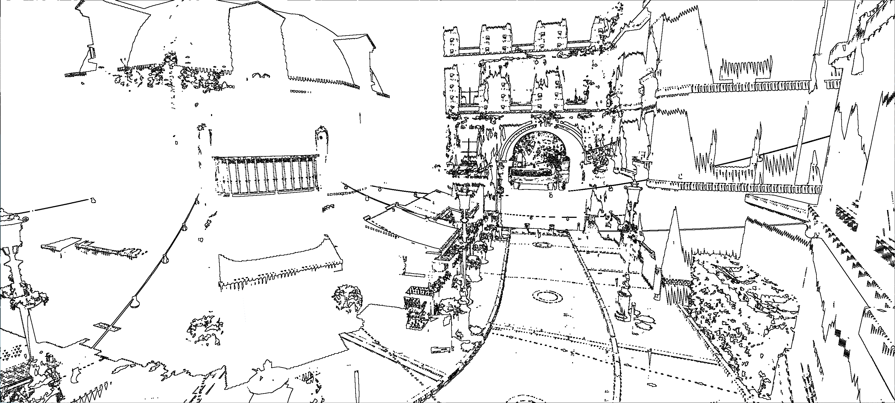 |

### Final with Shadow Map Resolution 4096x4096

| Shadow Box |
|---|
|  |

| Sponza |
|---|
| 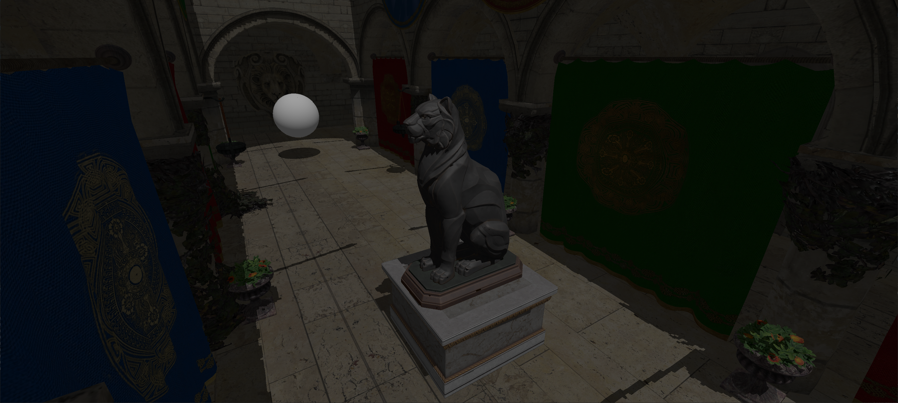 |

| Bistro Exterior |
|---|
| 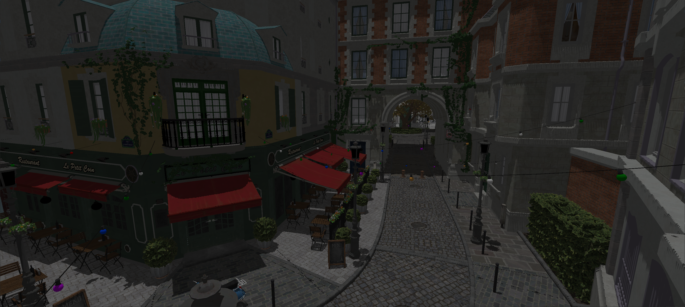 |

### Final with Shadow Map Resolution 16384x16384

| Shadow Box |
|---|
| 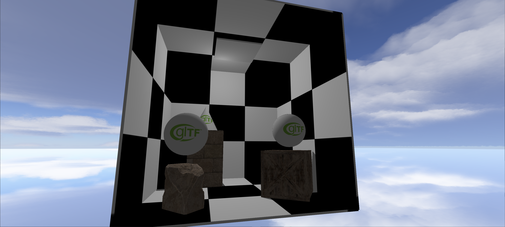 |

| Sponza |
|---|
| 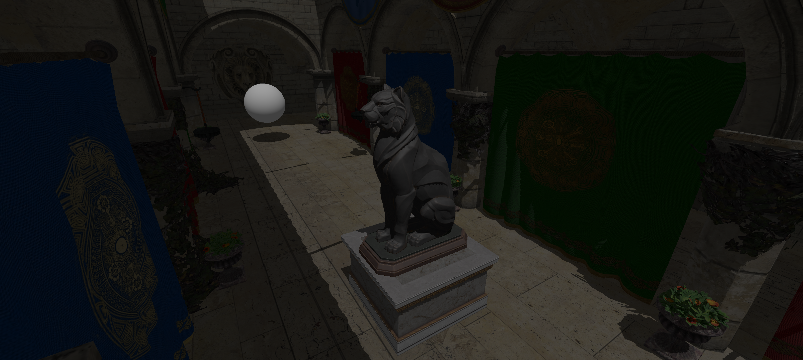 |

| Bistro Exterior |
|---|
|  |

---

## Performance

The following table shows the measured FPS for full ray tracing and hybrid rendering.

| Method | Asset 0 | Asset 1 | Asset 2 |
|---|---:|---:|---:|
| FullRT | 1356.5 | 608.4 | 394.1 |
| Hybrid 4096 | 674.8 | 431.4 | 369.8 |
| Hybrid 16384 | 292.1 | 296.1 | 159.9 |

Higher FPS indicates better performance.

In the tested PC environment, the hybrid rendering approach does not outperform full ray tracing. This is mainly because the test system uses an RTX 4090, which provides very high ray tracing performance for general Whitted-style ray tracing workloads.

As a result, the overhead introduced by the hybrid pipeline, such as rasterization based deferred rendering, Vulkan-CUDA synchronization, CUDA image processing, edge detection, and additional resource sharing, can outweigh the performance benefit gained from applying ray tracing only to selected shadow edge regions.

---

## References

1. [Experiments in Hybrid Raytraced Shadows](https://interplayoflight.wordpress.com/2021/05/15/experiments-in-hybrid-raytraced-shadows/)  
   This article inspired the selective ray-traced shadow approach used in this project.  
   This project and the referenced article are separate works.

2. [Sascha Willems' Vulkan Repository](https://github.com/SaschaWillems/Vulkan)  
   This project is based on Sascha Willems' Vulkan project structure and examples.

3. [Sascha Willems' Vulkan Assets Repository](https://github.com/SaschaWillems/Vulkan-Assets/tree/a27c0e584434d59b7c7a714e9180eefca6f0ec4b)  
   Used as a reference for the expected asset directory structure.

## License

This project is licensed under the MIT License.

This project is based on Sascha Willems' Vulkan project.  
Portions of the original Vulkan framework and examples are copyrighted by Sascha Willems and are also distributed under the MIT License.

See the [LICENSE](./LICENSE) file for details.